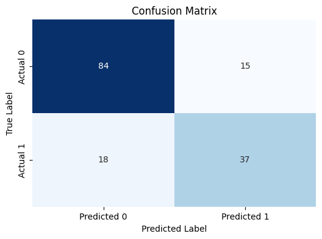
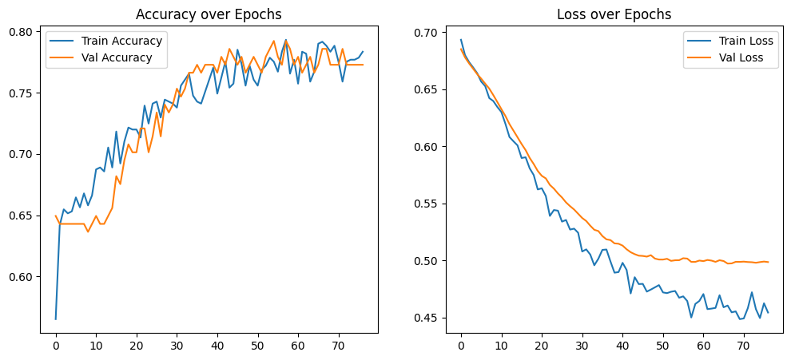

# Diabetes Prediction with Neural Networks

## 📌 Objective
Build and evaluate a neural network model to predict diabetes using the PIMA Indians dataset.

## 📂 Project Workflow
1. Data preprocessing (handling missing values, normalization)
2. Model building (TensorFlow/Keras)
3. Training with early stopping
4. Evaluation (confusion matrix, precision, recall, F1-score)

## 📊 Results
- **Accuracy:** ~79%
- **Precision (Class 1):** 0.71
- **Recall (Class 1):** 0.67  

### Confusion Matrix


### Training Accuracy Curve


## ▶️ How to Run
1. Open the notebook in Google Colab.
2. Install requirements:
   ```bash
   pip install -r requirements.txt
